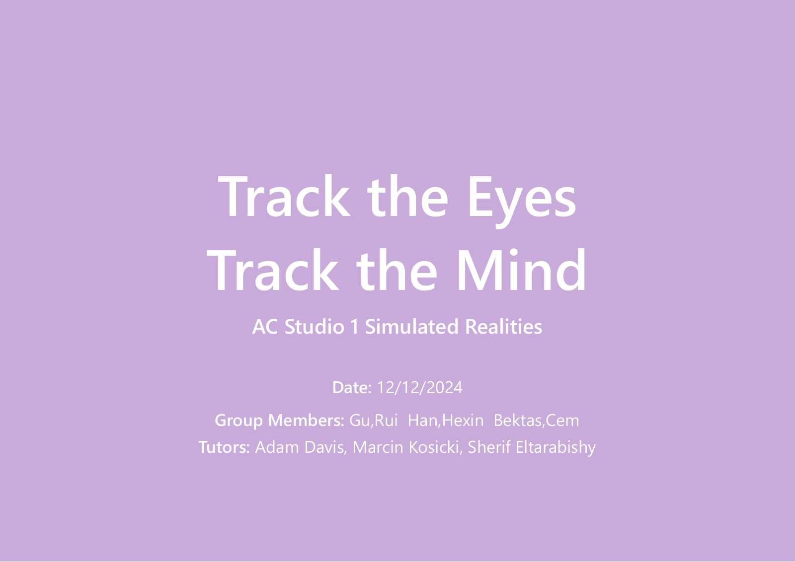
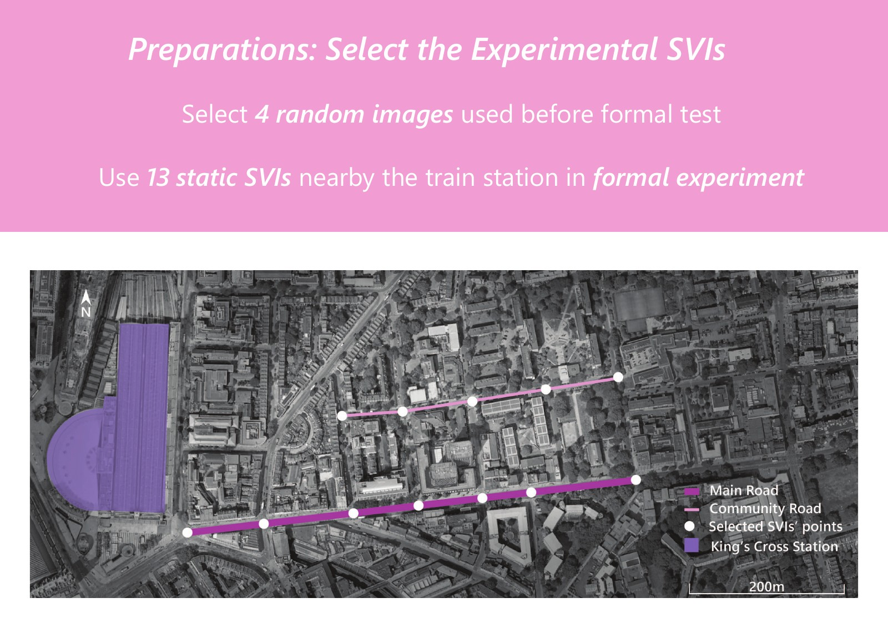
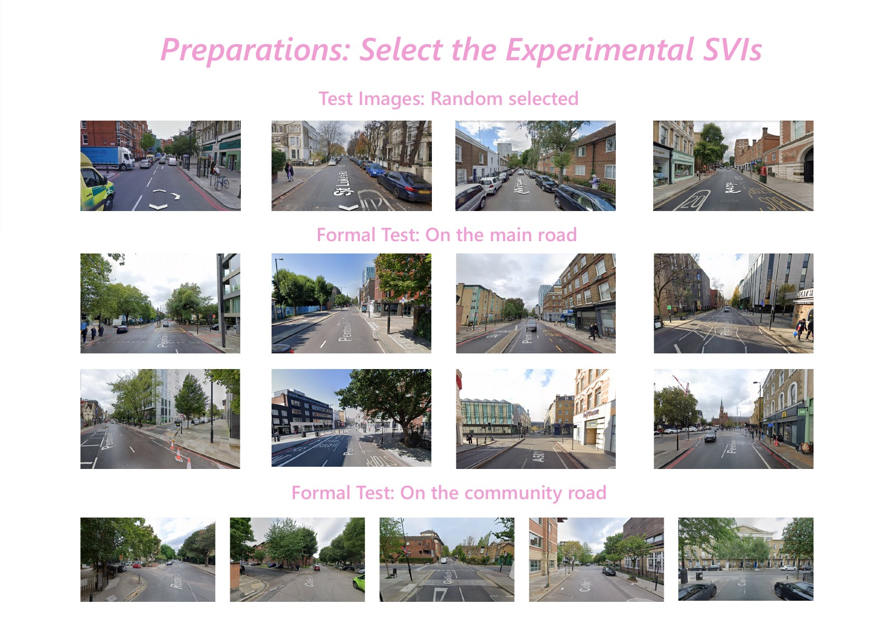
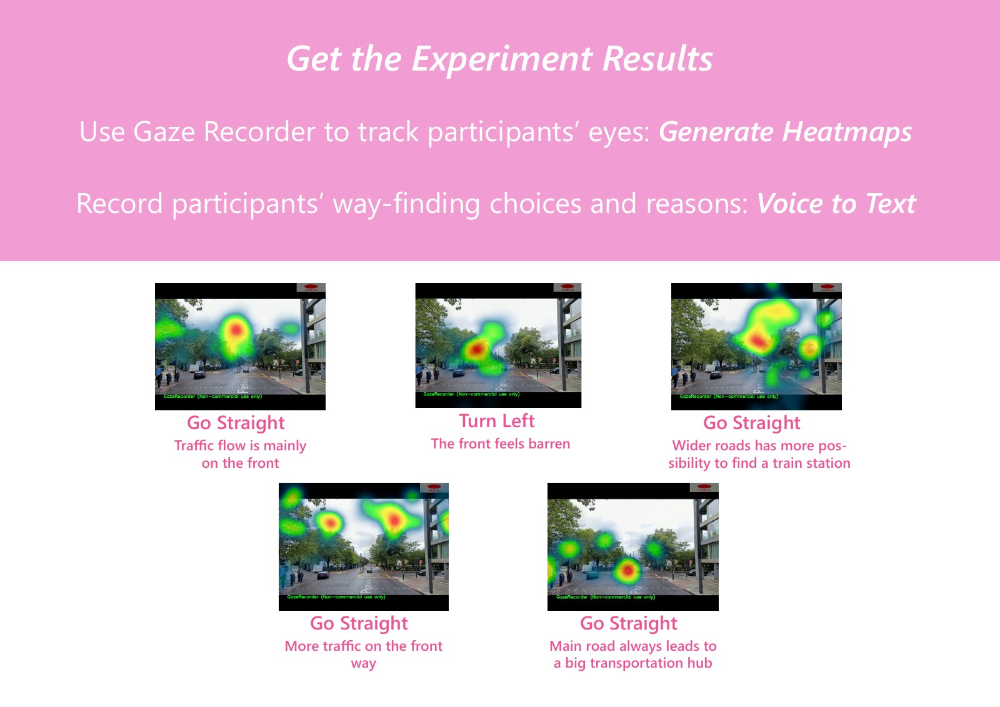
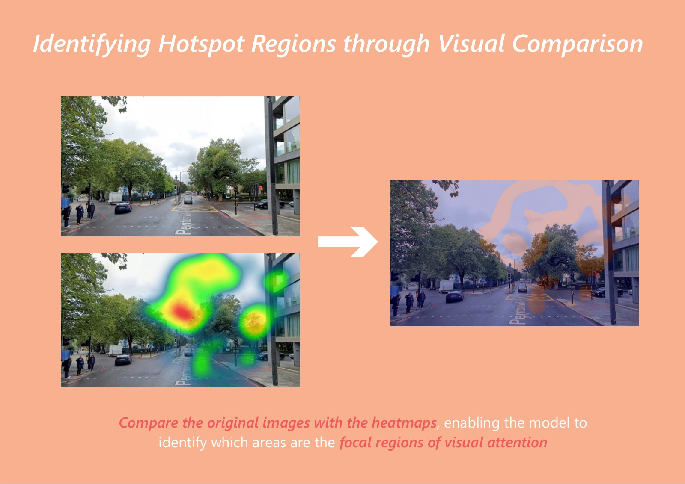

# Track the Eyes, Track the Mind

**Eye-tracking and multimodal exploration of pedestrian wayfinding**

UCL Bartlett School of Architecture · MSc Architectural Computation<br>
Digital Studio 1: Simulated Realities · October–December 2024<br>
**Team:** Rui Gu, Hexin Han, Cem Bektas



[Visual overview](#visual-overview) · [Study at a glance](#study-at-a-glance) · [Code guide](docs/CODE_GUIDE.md) · [Full presentation](docs/presentations/ProjectSlides_2024.pdf)

This pilot study explores the relationship between visual attention and reported route-choice reasoning when people search for a train station in static street-view scenes. It combines Gaze Recorder heatmaps, verbal explanations, pretrained CLIP features and an exploratory Random Forest classifier.

**Repository status:** historical research prototype, reorganised in October 2026. The seven original scripts are retained without changes to their contents. Documentation now distinguishes the collected material from the modelling subset and describes the actual implementation. This repository is a project archive, not a validated navigation system or a turnkey reproduction package.

## Research question

> What is the relationship between pedestrians’ visual attention distribution and the environmental cues they report using for wayfinding decisions when searching for a train station in static street-view images?

The task concerns choices in screen-based scenes near King's Cross, London. It does not measure complete real-world walking routes or establish causal effects of street design.

## Visual overview

Selected pages from our December 2024 presentation show the study setting, experimental stimuli and collected responses. Images can be opened at full resolution. These are archival illustrations; the current captions distinguish observations from model-validation claims.

### 1. Study setting: King's Cross, London



*Slide 12 — Selected viewpoints around the station, covering a main-road corridor and community-road scenes. The map records the study setting; it does not establish a representative sample of London streets.*

### 2. What participants saw



*Slide 13 — Four warm-up images followed by 13 formal stimuli: eight main-road and five community-road scenes. The distinction provides context for comparing responses across scene types.*

### 3. Gaze patterns alongside reported choices



*Slide 16 — Examples of the same street scene paired with different gaze heatmaps and verbal rationales. This illustrates the project's central idea: examine where participants looked alongside how they explained their choices. The examples are collected responses, not model-generated predictions.*

<details>
<summary><strong>View the heatmap-processing example</strong></summary>



*Slide 23 — Historical illustration of comparing a scene with its heatmap to create a processing overlay. The archived script uses cropping, resizing and image differences; this example is not evidence of a trained heatmap predictor or validated gaze localisation.*

</details>

[View the complete 38-slide presentation](docs/presentations/ProjectSlides_2024.pdf) · [Image sources and export details](docs/images/README.md)

## Study at a glance

| Item | Evidence-supported description |
|---|---|
| Formal stimuli | 13 static scenes: 8 main-road and 5 community-road images |
| Warm-up stimuli | 4 additional images |
| Participants | 5 university students, aged 22–23 |
| Collection | Gaze Recorder heatmaps, spoken route choices and reasons |
| Local heatmap archive | 5 sets of 13 images; file coverage does not establish trial validity |
| Archived modelling subset | 3 sets of 13 labels, image features and text features: 39 original records |
| Saved label values | 0, 1 and 2; the direction-to-code dictionary still needs confirmation |
| Model | Pretrained CLIP ViT-B/32 features followed by Random Forest classification |

The 39 modelling records must not be confused with the 65 participant–scene collection trials. Why only three groups have saved modelling artifacts has not yet been fully recovered from the records.

## Workflow actually implemented

```text
Static street-view scenes + Gaze Recorder heatmaps + verbal rationales
                         |
             Heatmap inspection / image processing
                         |
     Original image + heatmap -> CLIP image features -> vector average
     Verbal rationale        -> CLIP text features
                         |
             +-----------+-----------+
             |                       |
     Cosine similarity       Concatenate image + text features
             |                       |
     Similarity plot           SMOTE + Random Forest
                               (historical evaluation limitations)
```

CLIP is used for feature extraction without fine-tuning. The image script averages an original-scene embedding and a heatmap embedding; it does not feed an HSV hue channel into CLIP. The separate HSV script detects coloured contours for inspection. The classifier receives both visual features and participants’ verbal rationales, so it should be understood as exploratory classification of collected responses, not scene-only prediction of future decisions.

## Repository structure

```text
.
├── README.md
├── requirements-legacy.txt         # dependencies referenced by the archived scripts
├── scripts/
│   ├── 01_heatmap_processing/
│   │   ├── highlight_visual_differences.py
│   │   └── extract_visual_attention.py
│   ├── 02_feature_extraction/
│   │   ├── image_text_feature_analysis.py
│   │   └── text_feature_extraction.py
│   ├── 03_similarity_analysis/
│   │   └── feature_similarity_analysis.py
│   ├── 04_model_training/
│   │   └── train_path_choice_model_en.py
│   └── 05_visualization/
│       └── visualize_similarity.py
├── data/summary/
│   ├── README.md
│   ├── label_counts.csv
│   └── similarity_summary.json
└── docs/
    ├── images/                    # selected presentation pages used above
    ├── CODE_GUIDE.md
    ├── METHODS_AND_LIMITATIONS.md
    ├── DATA_AVAILABILITY.md
    ├── REORGANISATION.md
    └── presentations/
        └── ProjectSlides_2024.pdf
```

## Reading and running the code

Start with the [code guide](docs/CODE_GUIDE.md) for inputs, outputs, configuration variables and the recommended reading order. The scripts contain hard-coded path placeholders and **do not implement command-line flags or interactive path prompts**. The public repository contains summary tables, not the private input data or feature tensors.

To prepare a separate environment for inspecting the historical scripts:

```bash
python -m venv .venv
# Windows PowerShell:
.venv/Scripts/Activate.ps1
# macOS / Linux instead: source .venv/bin/activate
python -m pip install -r requirements-legacy.txt
```

These dependencies are inferred from imports; they are not a recovered 2024 environment lockfile. A full dependency installation and end-to-end model run were not performed during the 2026 reorganisation. CLIP downloads pretrained weights when first loaded; a CUDA GPU is optional because the feature scripts also select CPU.

After obtaining authorised inputs and setting the path variables, individual utilities can be invoked directly, for example:

```bash
python scripts/01_heatmap_processing/extract_visual_attention.py
python scripts/02_feature_extraction/image_text_feature_analysis.py
python scripts/02_feature_extraction/text_feature_extraction.py
python scripts/03_similarity_analysis/feature_similarity_analysis.py
python scripts/05_visualization/visualize_similarity.py
```

The text extractor's output names differ from the renamed feature files expected by the similarity script. Restore a participant–scene mapping rather than assuming these stages connect automatically. The historical classifier is retained for inspection; address the evaluation and alignment issues below before using it to produce a new performance claim.

## Findings and interpretation

The project provides an exploratory comparison of gaze patterns and reported reasoning about scene cues such as roads, buildings, vegetation, signage and traffic. It does not establish a validated ranking of cues or show that a cue causes a particular choice.

The archived 13-row similarity CSV has a mean cosine similarity of **0.235434**, with a range of **0.207830–0.267021**. These are descriptive statistics of that particular saved file; participant coverage and feature pairing require further verification. They are not a behavioural correlation, a significance test or a result across all 65 trials. See [summary provenance](data/summary/README.md).

The [original presentation](docs/presentations/ProjectSlides_2024.pdf) reported approximately 80% classification accuracy against a 50% baseline. The available implementation and execution evidence do not establish a reliable comparison, so those numbers are **not presented here as validated model performance**. The PDF is retained as a historical presentation and must be read alongside the current methodological notes.

## Important limitations

- **Sample alignment:** the classifier independently enumerates feature files and reads CSV labels by row position, without joining on participant and scene IDs.
- **Evaluation leakage:** SMOTE is applied before both cross-validation and the train/test split. Resampling must occur within training partitions in a corrected evaluation.
- **Repeated observations:** row-level splits do not independently evaluate unseen participants or unseen scenes.
- **Timing of language input:** rationales are collected with the choice and can contain direction information. They cannot support a claim of pre-decision, scene-only prediction.
- **Small, homogeneous sample:** five student participants and 13 scenes limit generalisation; the saved modelling subset is smaller still.
- **Measurement provenance:** per-session calibration settings, quantitative tracking accuracy, exclusions and the calculation chain for fixation charts are not fully recovered. Protocol and slideshow duration settings also differ.

The three saved label classes contain 11, 23 and 5 records respectively. The pooled majority-class proportion is 23/39 (about 59%), not a measured test-set baseline. Uniform random selection among three classes has expected accuracy of one third; the original 50% comparator has not been recovered as a documented experiment.

There is no heatmap-prediction model, trained ViT decoder, model checkpoint or independently verified generalisation result included in this repository. See [methods and limitations](docs/METHODS_AND_LIMITATIONS.md) for the evidence and a proposed reanalysis sequence.

## Contributions

- **Rui Gu:** project leadership; experimental design; recruitment and data collection; data organisation; guidance of the analytical approach.
- **Hexin Han and Cem Bektas:** team collaborators; the original technical implementation and analysis execution were carried out by teammates under Rui's guidance. The individual split of modelling tasks is not reconstructed here.

Historical script headers are preserved as archived metadata; they should not be read as a verified statement that Rui independently authored every script. This contribution statement reflects the clarified division of work. The October 2026 repository maintenance and documentation updates are distinct from the 2024 study.

## Data, attribution and reuse

Public material includes code documentation, small aggregate summaries and selected images rendered from the already-public presentation. The gallery includes only the heatmap and rationale examples already visible in that PDF. No additional participant names, face recordings, audio, full individual transcripts, raw gaze files, feature tensors or private experiment archive have been added. See [data availability](docs/DATA_AVAILABILITY.md).

The original presentation was already public and is retained with its existing image and literature credits. Its inclusion does not grant rights to redistribute third-party imagery or participant material. No new blanket licence is assigned to the team’s work during this reorganisation.

Implementation resources: [OpenAI CLIP](https://github.com/openai/CLIP), [imbalanced-learn leakage guidance](https://imbalanced-learn.org/dev/common_pitfalls.html), and [scikit-learn grouped cross-validation](https://scikit-learn.org/stable/modules/cross_validation.html).

```bibtex
@misc{gu2024trackeyes,
  title  = {Track the Eyes, Track the Mind},
  author = {Gu, Rui and Han, Hexin and Bektas, Cem},
  year   = {2024},
  note   = {Course project, MSc Architectural Computation,
            UCL Bartlett School of Architecture},
  url    = {https://github.com/gurui7913/AC_PedestrianNavigationDecisionMakingSystem}
}
```
